# Customer Retention & RFM Segmentation — Olist Brazilian E-Commerce

A customer analytics project focused on understanding customer behaviour, purchase patterns, revenue contribution, and retention using **RFM segmentation, cohort analysis, statistical validation, and SQL/Python-based analysis** on the Olist Brazilian E-Commerce dataset.

The project goes beyond basic exploratory data analysis by translating customer-level transaction data into actionable business segments and retention insights.

---

## 1. Project Overview

Customer retention is an important driver of long-term e-commerce revenue. However, a customer database containing thousands of transactions does not directly explain:

* Which customers are valuable?
* Which customers are becoming inactive?
* How many customers purchase only once?
* Which customer segments contribute the most revenue?
* How well are newly acquired customers retained?
* Are payment methods associated with repeat purchasing behaviour?
* Which product categories generate the most revenue?

This project addresses these questions by combining transactional analysis with **RFM (Recency, Frequency, Monetary) segmentation**, **cohort-based retention analysis**, and **statistical testing**.

The analysis uses the publicly available **Olist Brazilian E-Commerce dataset** and is implemented primarily in Python, with SQL equivalents provided for important analytical operations.

---

## 2. Business Problem

An e-commerce business can generate a large number of orders while still struggling to retain customers.

A high number of customers does not necessarily mean a healthy customer base. For example:

* A large proportion of customers may purchase only once.
* High-value customers may represent a very small part of the customer base.
* Previously active customers may become inactive.
* Revenue may be concentrated in specific customer segments or product categories.
* Customer retention may vary significantly across acquisition cohorts.

The objective of this project is therefore to transform raw transactional data into a structured view of:

**Customer Value → Customer Segmentation → Retention → Statistical Evidence → Business Actions**

---

## 3. Business Objectives

The analysis focuses on the following objectives:

1. Understand the overall customer base.
2. Segment customers using RFM analysis.
3. Identify high-value and inactive customer groups.
4. Compare customer segments based on revenue, frequency, and recency.
5. Analyse monthly revenue trends.
6. Identify top product categories by revenue.
7. Understand payment method distribution.
8. Measure customer retention using cohort analysis.
9. Statistically test whether payment type is associated with repeat purchasing.
10. Translate analytical findings into actionable business recommendations.

---

## 4. Dataset

The project uses the **Olist Brazilian E-Commerce Public Dataset**, containing information about orders, customers, payments, order items, products, sellers, and related transactional attributes.

The analysis uses multiple source tables and combines them to construct the analytical dataset.

### Main tables used

| Table       | Purpose                                                                |
| ----------- | ---------------------------------------------------------------------- |
| Orders      | Order lifecycle, purchase dates, delivery information and order status |
| Customers   | Customer identifiers and geographical information                      |
| Payments    | Payment methods and payment values                                     |
| Order Items | Product-level order information, prices and freight                    |
| Products    | Product categories and product attributes                              |

---

## 5. Data Preparation

The raw tables were inspected and cleaned before performing customer-level analysis.

### Main preparation steps

* Reviewed dataset structure and data types.
* Converted timestamp columns to appropriate datetime formats.
* Aggregated payment information at order level.
* Aggregated item-level information where required.
* Combined relevant tables into a master analytical dataset.
* Filtered the analysis to delivered orders for customer RFM analysis.
* Checked missing values and potential data-quality issues.
* Created customer-level purchase metrics.

### Analytical datasets

The project works with the following important datasets:

```text
orders
customers
payments
items
products
master_df
rfm
```

The final delivered-order dataset contains approximately:

* **96,478 delivered orders**
* **93,358 unique customers**

These figures are specific to the filtering and aggregation logic used in this project.

---

# 6. RFM Analysis

RFM analysis was used to understand customer behaviour using three dimensions:

### Recency

**How recently did the customer make a purchase?**

Lower Recency indicates a more recent purchase.

```text
Recency = Analysis Date - Customer's Last Purchase Date
```

### Frequency

**How frequently does the customer purchase?**

```text
Frequency = Number of Distinct Orders
```

### Monetary

**How much has the customer spent?**

```text
Monetary = Total Customer Payment Value
```

The three metrics were calculated at the `customer_unique_id` level.

---

## 7. RFM Scoring

Each customer received:

* R Score
* F Score
* M Score

These were combined to create an overall RFM score used for segmentation.

### Important Frequency consideration

Frequency was highly skewed in this dataset.

Approximately **90,557 customers had only one purchase**, meaning that applying a standard quantile-based method such as `qcut` to Frequency would not provide meaningful separation between customers.

Therefore, a **business-rule-based Frequency scoring approach** was used instead.

This preserves meaningful differentiation between one-time and repeat customers rather than forcing highly concentrated frequency values into artificial quartiles.

---

# 8. Customer Segmentation

The final RFM framework produced six customer segments:

| Segment             |  Customers |    Share |
| ------------------- | ---------: | -------: |
| Lost                |     46,090 |   49.37% |
| Potential Loyalists |     22,613 |   24.22% |
| Needs Attention     |     22,527 |   24.13% |
| Loyal Customers     |      1,474 |    1.58% |
| At Risk             |        579 |    0.62% |
| Champions           |         75 |    0.08% |
| **Total**           | **93,358** | **100%** |

The segmentation provides a customer-level framework for analysing both customer value and engagement.

---

# 9. Customer Distribution by RFM Segment

### Business Question

> How is the customer base distributed across different RFM segments?

The customer base is highly concentrated in the **Lost** segment, which represents **49.37%** of customers.

Potential Loyalists and Needs Attention together represent:

**48.35% of the customer base.**

This means that a large proportion of customers fall outside the highest-value repeat-purchase segments.

### Screenshot

Add the customer segment distribution chart here:


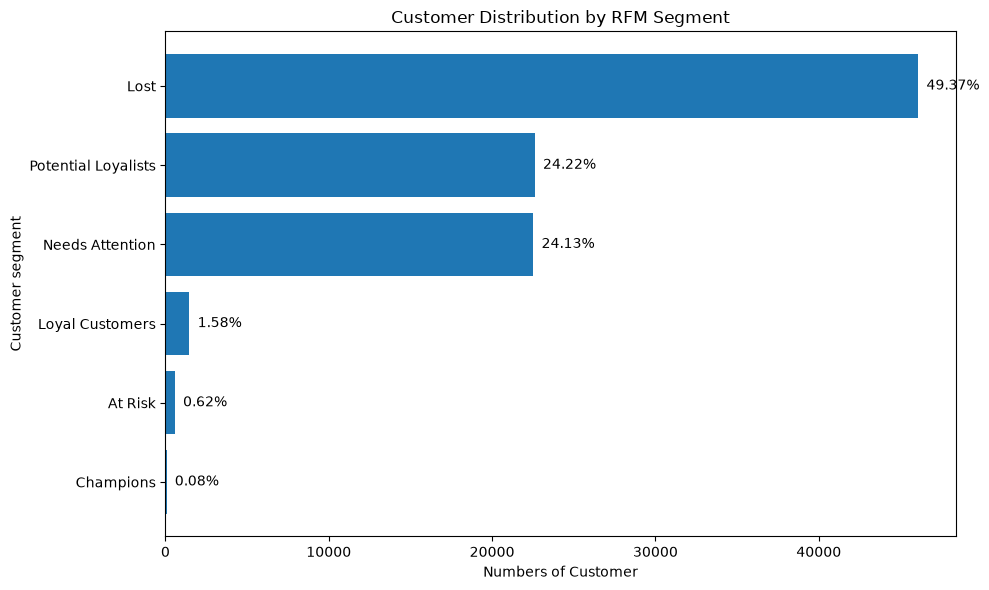


---

# 10. Revenue Contribution by RFM Segment

### Business Question

> Which customer segments contribute the most revenue?

| Segment             |      Revenue | Revenue Share |
| ------------------- | -----------: | ------------: |
| Lost                | 7,467,322.92 |        48.42% |
| Potential Loyalists | 3,723,035.41 |        24.14% |
| Needs Attention     | 3,575,773.85 |        23.19% |
| Loyal Customers     |   440,435.53 |         2.86% |
| At Risk             |   168,802.35 |         1.09% |
| Champions           |    47,091.71 |         0.31% |

The revenue distribution broadly follows the large customer concentration in the major segments.

Smaller segments such as Loyal Customers and Champions have higher revenue contribution relative to their customer share, indicating higher value per customer.

### Screenshot


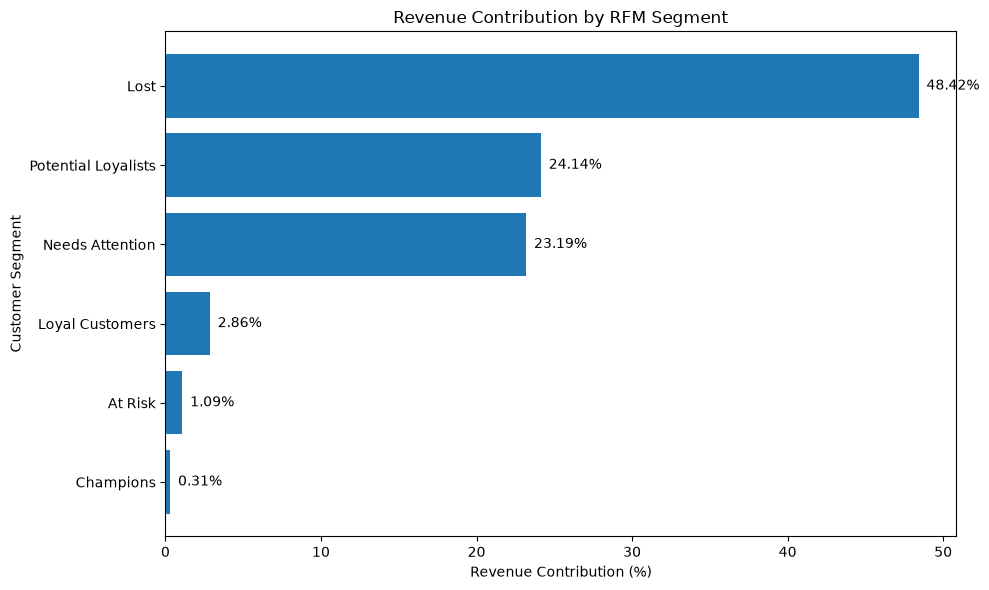


---

# 11. Average Customer Monetary Value by Segment

### Business Question

> Which customer segments have the highest average customer value?

Champions have the highest average Monetary value:

**627.89**

Needs Attention has the lowest:

**158.73**

The average Monetary value of Champions is approximately:

**3.96×**

the average Monetary value of Needs Attention customers.

This demonstrates why customer-level segmentation is more informative than looking only at total customer counts.

### Screenshot


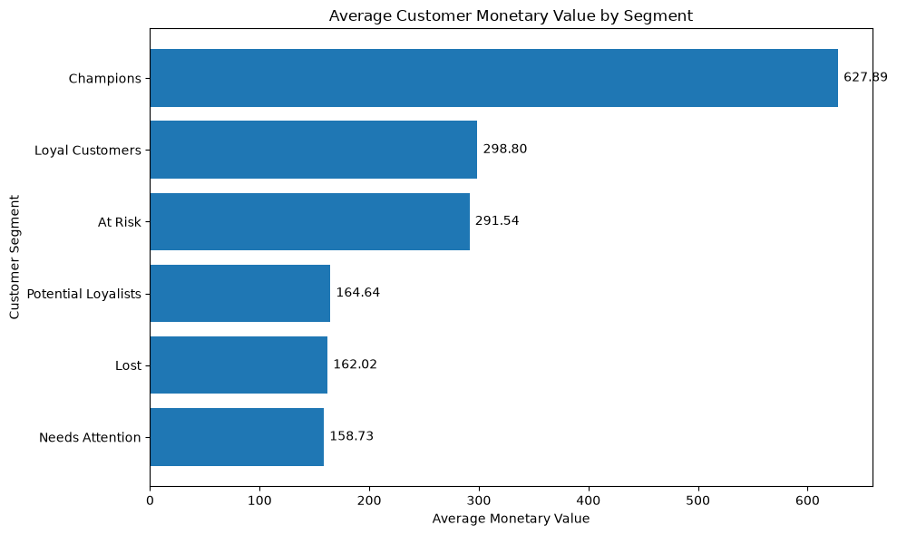


---

# 12. Average Purchase Frequency by Customer Segment

### Business Question

> Which customer segments make purchases more frequently?

Champions have the highest average purchase frequency:

**3.61 orders per customer**

Potential Loyalists and Needs Attention both average approximately:

**1.00 order per customer**

This reflects the strong concentration of one-time buyers in the dataset.

### Screenshot


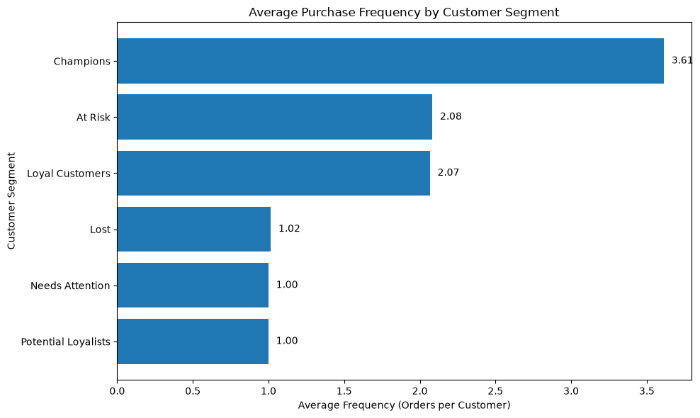


---

# 13. Average Customer Recency by Segment

### Business Question

> Which customer segments have purchased most recently, and which have been inactive for longer?

Average Recency by segment:

| Segment             | Average Recency |
| ------------------- | --------------: |
| Potential Loyalists |           57.50 |
| Champions           |           57.77 |
| Loyal Customers     |          115.77 |
| Needs Attention     |          277.33 |
| Lost                |          308.88 |
| At Risk             |          439.65 |

Recency must be interpreted in the opposite direction from most metrics:

**Lower Recency = more recent purchase**

**Higher Recency = longer inactivity**

The At Risk segment has the highest average Recency, while Potential Loyalists have the lowest.

### Screenshot


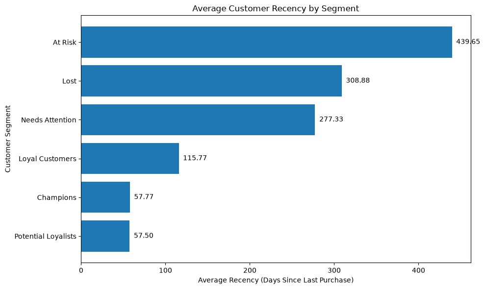


---

# 14. Recency vs Frequency Analysis

### Business Question

> Can we identify patterns between customer recency and purchase frequency across different customer segments?

A scatter plot was used to compare:

* X-axis: Recency
* Y-axis: Frequency
* Hue: Customer Segment

The visualization helps identify clusters of:

* recent customers,
* inactive customers,
* repeat purchasers,
* high-frequency customers,
* unusual observations.

The chart is descriptive and is not used to infer causation.

### Screenshot


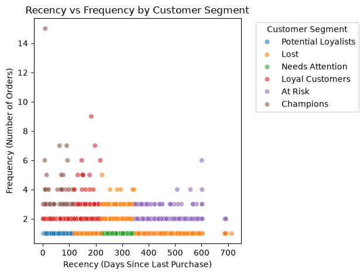


---

# 15. RFM Value Distributions

Separate distributions were created for:

* Recency
* Frequency
* Monetary

### Frequency

Frequency is extremely right-skewed, with the majority of customers concentrated at one purchase and a small long tail of repeat customers.

### Recency

Recency is more broadly distributed across the observed customer base, with customers spread across different levels of purchase inactivity.

### Monetary

Monetary value is strongly right-skewed, with most customers concentrated at lower spending levels and a small number of high-value customers forming a long tail.

These distributions explain why customer segmentation requires careful handling of skewed variables.

### Screenshots


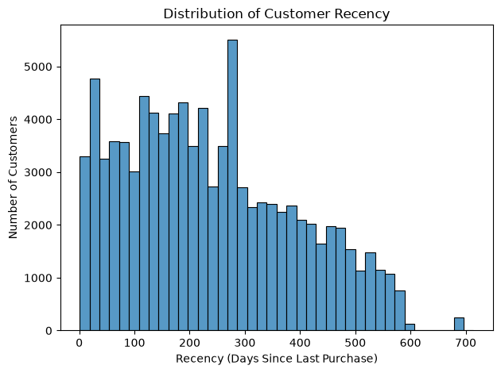

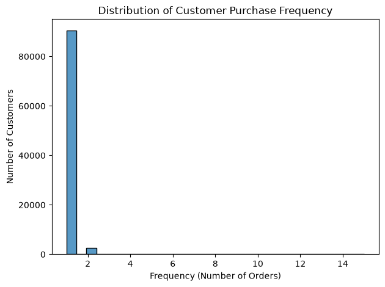

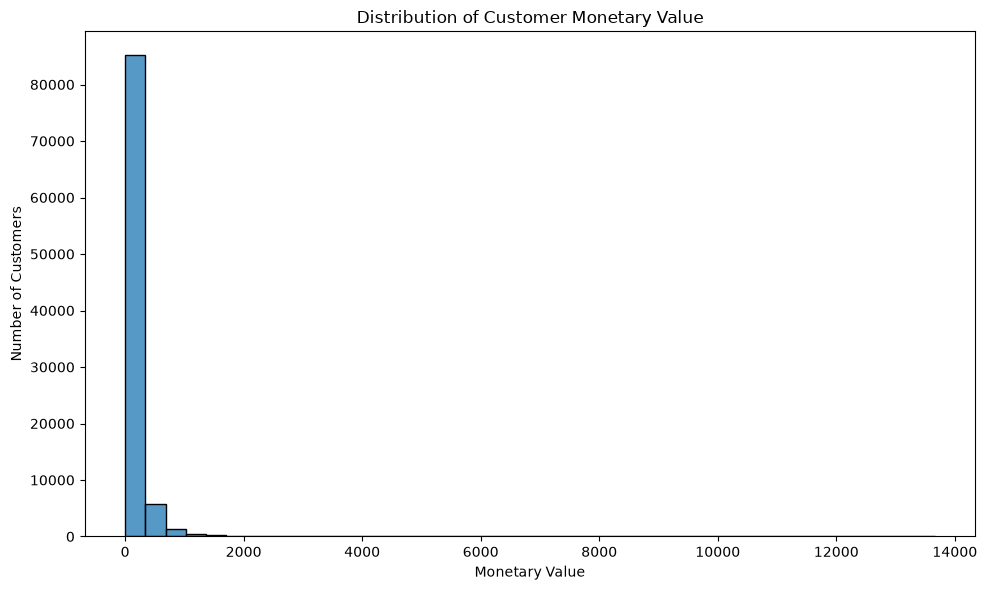


---

# 16. Monthly Revenue Trend

### Business Question

> How did revenue change over the observed period?

Revenue was aggregated by purchase month.

The observed period extends from **September 2016 to August 2018**.

Revenue increased substantially from the early period and reached approximately:

**1.15 million in November 2017**

Several months in 2018 remained around or above the 1 million level.

The November 2017 peak is visible in the revenue timeline, followed by a decline in December and recovery in January 2018.

The analysis identifies the pattern but does not assume a specific causal reason without supporting evidence.

### Screenshot


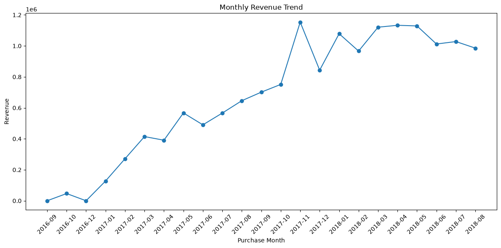


---

# 17. Top 10 Product Categories by Revenue

### Business Question

> Which product categories generate the most revenue?

Top categories by revenue include:

| Product Category       |      Revenue |
| ---------------------- | -----------: |
| beleza_saude           | 1,233,131.72 |
| relogios_presentes     | 1,166,176.98 |
| cama_mesa_banho        | 1,023,434.76 |
| esporte_lazer          |   954,852.55 |
| informatica_acessorios |   888,724.61 |
| moveis_decoracao       |   711,927.69 |
| utilidades_domesticas  |   615,628.69 |
| cool_stuff             |   610,204.10 |
| automotivo             |   578,966.65 |
| brinquedos             |   471,286.48 |

The category analysis helps identify which product groups contribute most to transaction revenue.

### Screenshot


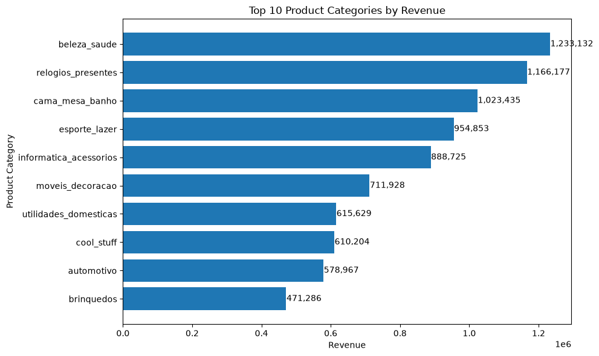


---

# 18. Payment Method Distribution

### Business Question

> How are payments distributed across different payment methods?

Payment method share:

| Payment Type |  Share |
| ------------ | -----: |
| Credit Card  | 73.92% |
| Boleto       | 19.04% |
| Voucher      |  5.56% |
| Debit Card   |  1.47% |
| Not Defined  | 0.003% |

Credit card is the dominant payment method in the analysed transaction data.

### Screenshot


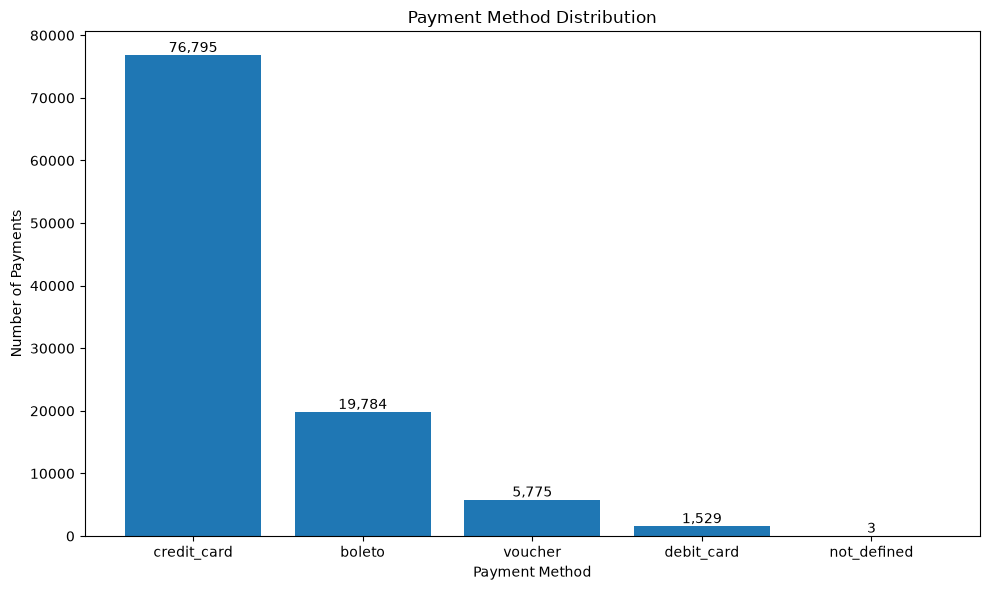


---

# 19. Cohort Retention Analysis

RFM segmentation describes **who the customers are**, but it does not fully answer:

> "Do customers come back after their first purchase?"

To answer this, cohort analysis was performed.

## Cohort Definition

Each customer was assigned to a cohort based on the month of their **first purchase**.

For example:

```text
Customer first purchase → September 2017

Cohort Month → 2017-09
```

Subsequent purchases were then compared against the customer's first-purchase month.

---

## Cohort Index

The cohort index represents the number of months since the customer's acquisition month.

```text
Month 0 → Acquisition month
Month 1 → One month after acquisition
Month 2 → Two months after acquisition
Month 3 → Three months after acquisition
...
```

For example, if a customer joined in September 2017:

```text
2017-09 → Month 0
2017-10 → Month 1
2017-11 → Month 2
2017-12 → Month 3
```

---

## Retention Calculation

Retention was calculated relative to the number of customers in Month 0.

For a given cohort:

```text
Retention % =
Customers Active in Cohort Month
/
Customers in Month 0
× 100
```

Therefore, every cohort begins at:

**100%**

and later months represent the proportion of the original cohort that returned.

---

## Reading the Retention Heatmap

A cell such as:

```text
2017-09 | Month 1 | 69.93%
```

means:

> 69.93% of customers whose first purchase occurred in September 2017 made another purchase one month later.

It does **not** mean that 69.93% of all customers purchased during September 2017.

The heatmap therefore allows retention behaviour to be compared across different acquisition cohorts.

### Screenshot


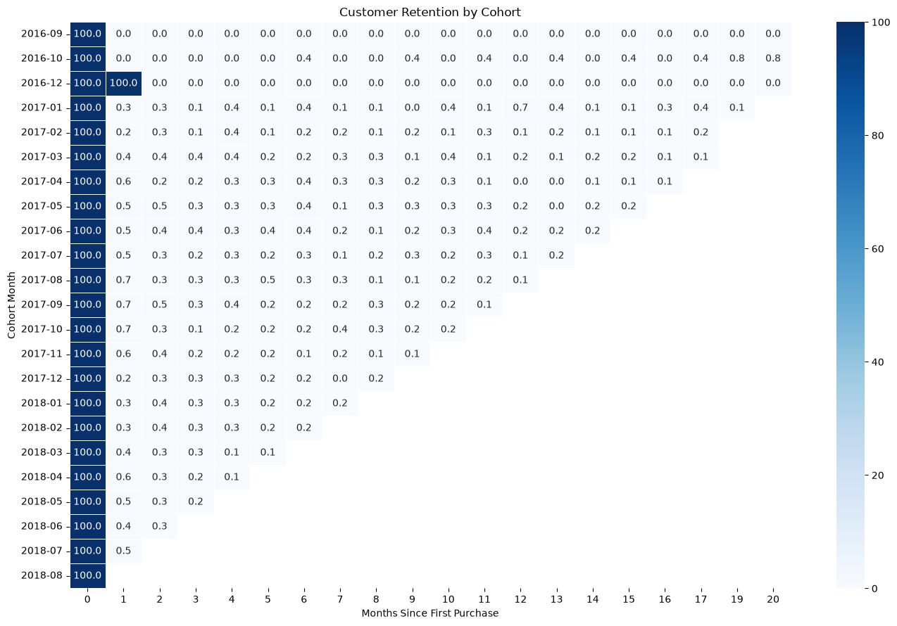


---

# 20. Statistical Validation

A statistical test was performed to investigate whether payment type is associated with repeat-purchase status.

### Business Question

> Is payment type associated with whether a customer makes repeat purchases?

### Variables

**Payment Type**

* Credit Card
* Boleto
* Debit Card
* Voucher

**Repeat Status**

* One-Time
* Repeat

Repeat customer definition:

```text
Frequency > 1
```

---

## Hypotheses

### Null Hypothesis — H0

Payment type and repeat-purchase status are independent.

### Alternative Hypothesis — H1

Payment type and repeat-purchase status are associated.

---

## Contingency Table

The observed frequencies were:

| Payment Type | One-Time | Repeat |
| ------------ | -------: | -----: |
| Boleto       |   18,032 |    516 |
| Credit Card  |   68,312 |  2,152 |
| Debit Card   |    1,406 |     35 |
| Voucher      |    2,764 |     98 |

A Chi-square test of independence was then performed.

### Results

```text
Chi-square statistic = 7.3057
Degrees of freedom   = 3
p-value              = 0.06277
Significance level   = 0.05
```

Since:

```text
p-value > 0.05
```

the analysis **fails to reject the null hypothesis** at the 5% significance level.

Therefore, this analysis does not provide sufficient statistical evidence at α = 0.05 to conclude that payment type and repeat-purchase status are associated.

This is an association test only and does not establish causation.

---

## Expected Frequencies

Expected frequencies were also inspected as part of the Chi-square analysis.

They represent the counts that would be expected if payment type and repeat status were independent.

This comparison helps explain how the Chi-square statistic is generated from the difference between observed and expected frequencies.

---

# 21. Business Insights

The combined analysis produces several quantified observations.

### 1. Customer concentration

The Lost segment contains:

**49.37% of customers**

and contributes:

**48.42% of revenue.**

This shows that a very large customer group is currently classified as inactive under the RFM framework.

### 2. High-value customer behaviour

Champions represent only:

**0.08% of customers**

but have:

* Average Monetary: **627.89**
* Average Frequency: **3.61 orders/customer**

This identifies a small but behaviourally distinct high-value customer group.

### 3. One-time purchasing is widespread

Approximately **90,557 customers** have only one purchase.

This explains the highly concentrated Frequency distribution and indicates that repeat purchasing is relatively uncommon in the dataset.

### 4. Customer recency varies substantially

Average Recency ranges from approximately:

**57.50 days**

for Potential Loyalists to:

**439.65 days**

for At Risk customers.

This represents a substantial difference in recent engagement across segments.

### 5. Revenue growth over time

Monthly revenue increased substantially over the observed period and reached approximately:

**1.15 million in November 2017.**

The revenue trend also shows periods of decline and recovery rather than perfectly continuous growth.

---

# 22. Business Recommendations

The recommendations below are based on the observed customer segmentation and retention patterns.

## Champions

* Prioritize retention of high-value repeat customers.
* Consider loyalty-oriented benefits.
* Use personalized product recommendations based on previous purchases.
* Monitor this group for changes in purchase recency.

## Loyal Customers

* Encourage continued repeat purchasing.
* Use cross-selling and complementary product recommendations.
* Monitor recency to identify movement toward inactive segments.

## Potential Loyalists

* Focus on converting recent one-time customers into repeat buyers.
* Use targeted follow-up communication.
* Recommend related products based on previous purchases.
* Test incentives designed specifically around a second purchase.

## At Risk

* Prioritize customers with previous repeat-purchase behaviour.
* Use targeted win-back campaigns.
* Consider customer value before allocating incentives.

## Needs Attention

* Encourage the second purchase through low-cost engagement campaigns.
* Use product recommendations and relevant follow-up communication.
* Avoid applying expensive retention strategies uniformly across the entire segment.

## Lost

* Use selective reactivation rather than treating all inactive customers equally.
* Prioritize previously higher-value customers where reactivation economics are more favourable.
* Test different re-engagement strategies and measure their incremental impact.

---

# 23. SQL Equivalents

Important analytical operations were also translated into SQL to demonstrate how the same customer analytics workflow could be implemented in a relational database environment.

Examples include:

### Recency

```sql
SELECT
    customer_unique_id,
    DATEDIFF(
        day,
        MAX(customer_order_date),
        MAX(order_date_overall)
    ) AS recency
FROM customer_orders
GROUP BY customer_unique_id;
```

### Frequency

```sql
SELECT
    customer_unique_id,
    COUNT(DISTINCT order_id) AS frequency
FROM customer_orders
GROUP BY customer_unique_id;
```

### Monetary

```sql
SELECT
    customer_unique_id,
    SUM(payment_value) AS monetary
FROM customer_orders
GROUP BY customer_unique_id;
```

### Quartile-Based Scoring

```sql
NTILE(4) OVER (
    ORDER BY recency_days DESC
) AS r_score
```

```sql
NTILE(4) OVER (
    ORDER BY frequency
) AS f_score
```

```sql
NTILE(4) OVER (
    ORDER BY monetary
) AS m_score
```

The SQL equivalents are included as analytical translations of the Python workflow rather than as a separate production database implementation.

The Frequency scoring logic in the main analysis remains business-rule-based because of the extreme concentration of one-time buyers.

---

# 24. Technology Stack

### Programming & Analysis

* Python
* Pandas
* NumPy
* SciPy

### Visualization

* Matplotlib
* Seaborn

### Querying & Data Analysis

* SQL

### Development Environment

* Jupyter Notebook

---

# 25. Project Structure

Recommended repository structure:

```text
customer-retention-rfm/
│
├── notebooks/
│   └── customer_retention_rfm.ipynb
│
├── sql/
│   ├── 01_customer_rfm.sql
│   ├── 02_customer_segmentation.sql
│   ├── 03_revenue_analysis.sql
│   ├── 04_cohort_retention.sql
│   └── 05_statistical_analysis.sql
│
├── assets/
│   ├── customer_segment_distribution.png
│   ├── revenue_contribution_segment.png
│   ├── avg_monetary_by_segment.png
│   ├── avg_frequency_by_segment.png
│   ├── avg_recency_by_segment.png
│   ├── recency_vs_frequency.png
│   ├── recency_distribution.png
│   ├── frequency_distribution.png
│   ├── monetary_distribution.png
│   ├── monthly_revenue_trend.png
│   ├── top_product_categories.png
│   ├── payment_method_distribution.png
│   └── cohort_retention_heatmap.png
│
├── data/
│   └── Data_files
│
├── README.md
└── requirements.txt
```

The raw Olist dataset does not need to be committed to GitHub if licensing, repository size, or reproducibility considerations make that undesirable. The README can instead document where the dataset can be obtained.

---

# 26. How to Run the Project

## 1. Clone the repository

```bash
git clone <your-repository-url>
cd customer-retention-rfm
```

## 2. Create a virtual environment

Windows:

```bash
python -m venv .venv
```

Activate it:

```bash
.venv\Scripts\activate
```

## 3. Install dependencies

```bash
pip install -r requirements.txt
```

## 4. Add the dataset

Place the required Olist CSV files inside the appropriate data directory.

Example:

```text
data/
├── olist_orders_dataset.csv
├── olist_customers_dataset.csv
├── olist_order_payments_dataset.csv
├── olist_order_items_dataset.csv
└── olist_products_dataset.csv
```

## 5. Open the notebook

```bash
jupyter notebook
```

Open:

```text
notebooks/customer_retention_rfm.ipynb
```

Run the notebook from top to bottom.

The notebook should be executed from a fresh kernel so that all transformations and calculations are reproducible.

---

# 27. Reproducibility Notes

The analysis depends on several important assumptions:

* RFM analysis is performed at the `customer_unique_id` level.
* Delivered orders are used for the primary RFM customer analysis.
* Frequency represents distinct orders.
* Monetary value is based on customer payment value.
* Lower Recency represents more recent customer activity.
* Repeat customers are defined as customers with `Frequency > 1`.
* Cohort Month represents the customer's first purchase month.
* Cohort Month 0 represents the acquisition month.
* Retention percentages are calculated relative to the Month 0 cohort size.
* Statistical significance is evaluated using α = 0.05.

These assumptions should be considered when interpreting the results.

---

# 28. Limitations

This analysis has several limitations.

### 1. Observational data

The dataset records historical transactions. It does not provide experimental evidence for the effectiveness of specific marketing actions.

### 2. RFM segmentation is rule-based

RFM segments depend on the selected scoring methodology and business rules. Different scoring thresholds may produce different segment distributions.

### 3. Frequency is highly concentrated

The large number of one-time buyers makes conventional quantile-based Frequency scoring unsuitable without additional treatment.

### 4. Retention is transaction-based

A customer is considered retained when they make another recorded purchase. The analysis does not capture customers who interact with the business without placing an order.

### 5. Statistical association is not causation

The Chi-square test evaluates whether two categorical variables are statistically associated. It does not establish that payment method causes repeat purchasing behaviour.

### 6. Historical dataset

The results describe the behaviour represented in the Olist dataset and should not automatically be interpreted as current e-commerce market behaviour.

---

# 29. Key Takeaways

The project demonstrates how transactional e-commerce data can be transformed into a customer analytics framework:

```text
Raw Transaction Data
        ↓
Data Cleaning & Aggregation
        ↓
Customer-Level Dataset
        ↓
RFM Calculation
        ↓
Customer Segmentation
        ↓
Revenue & Behaviour Analysis
        ↓
Cohort Retention Analysis
        ↓
Statistical Validation
        ↓
Business Insights
        ↓
Actionable Recommendations
```

The analysis highlights a customer base dominated by one-time and inactive customers, alongside a much smaller group of frequent and higher-value customers.

The combination of **RFM segmentation + cohort retention + statistical validation** provides a more complete view of customer behaviour than relying on revenue or order counts alone.

---

# 30. Author

**Naman Prabhakar**

IIT Madras ( BS in Data Science )

Focus areas:

* Data Analytics
* SQL
* Python
* Business Intelligence
* Customer Analytics
* Statistical Analysis
* Machine Learning
